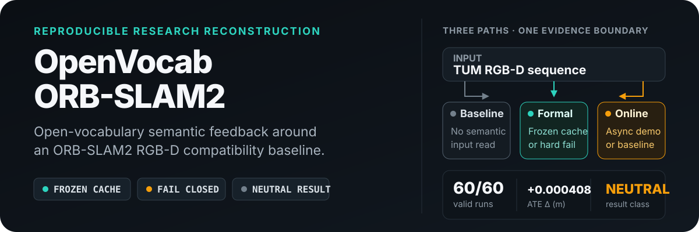
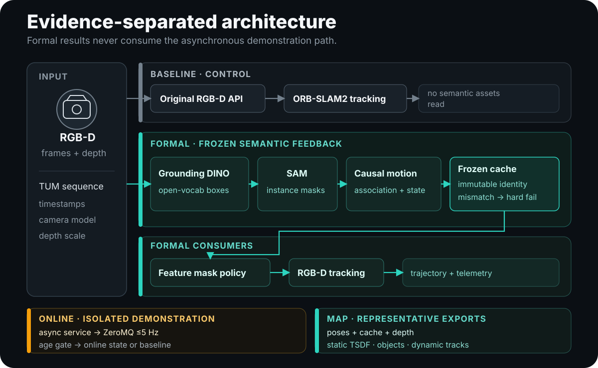

<p align="center">
  
</p>

<p align="center">
  <a href="https://github.com/raulmur/ORB_SLAM2"></a>
  
  
  
  
  <a href="./License-gpl.txt"></a>
</p>

OpenVocab-ORB-SLAM2 is a **reproducible research reconstruction** of an open-vocabulary semantic-feedback framework around the ORB-SLAM2 RGB-D pipeline. It adds frozen semantic evidence, causal dynamic-score estimation, dynamic-feature filtering, an isolated online demonstration path, and static semantic-map tooling.

> [!IMPORTANT]
> This repository is a derivative of [ORB-SLAM2](https://github.com/raulmur/ORB_SLAM2) at upstream commit `f2e6f51cdc8d067655d90a78c06261378e07e8f3`. It is not the paper's executable ground truth, and it does not claim that semantic feedback improves localization.

## Evidence at a glance

The approved P08 study evaluated six TUM RGB-D sequences, two modes, and five paired seeds. All 60 planned conditions were valid, but the localization result was **neutral**.

| Evidence | Approved observation | Interpretation boundary |
| --- | --- | --- |
| Formal localization study | 60/60 valid paired runs | Complete protocol execution, not proof of improvement |
| Median paired ATE delta | `+0.000407814 m` | Semantic-feedback minus baseline; lower would be better |
| 95% paired-bootstrap CI | `[-0.000586581, +0.005119730] m` | The interval does not support a positive localization claim |
| Online P06 demonstration | No packet met the `250 ms` causal-age limit | Degraded-only demonstration; not real-time evidence |
| P07 map exports | Static TSDF, object records, dynamic tracks | Representative outputs; not semantic-map accuracy measurements |

Read the concise [experiment card](docs/EXPERIMENT_CARD.md) or the frozen [P08 protocol](docs/design/P08_STUDY.md) for the complete evidence contract.

## What this reconstruction adds

The original ORB-SLAM2 code and attribution are preserved. The reconstruction layers explicit semantic and reproducibility contracts around its RGB-D path.

| Area | Upstream-compatible baseline | Reconstruction layer |
| --- | --- | --- |
| Tracking | Original RGB-D tracking signature | Dynamic-feature mask policy before depth association and matching |
| Open vocabulary | Not part of upstream ORB-SLAM2 | Pinned Grounding DINO proposals and SAM instance masks |
| Motion evidence | Geometric SLAM state | RGB-D centroids, bootstrap poses, association, Kalman state, and hysteresis |
| Formal semantics | No semantic input | Immutable per-frame dynamic-score cache with fail-closed identity checks |
| Online semantics | Not applicable | Nonblocking ZeroMQ latest-frame demonstration with bounded degradation |
| Mapping | Sparse ORB map | Static TSDF fusion, object records, and dynamic-track export tooling |
| Evaluation | Upstream examples | Paired study runner, telemetry, manifests, validation, and artifact hashing |

## System architecture

<p align="center">
  
</p>

The architecture deliberately separates three evidence paths:

- **Baseline** calls the original RGB-D tracking signature and never reads semantic inputs.
- **Semantic feedback** is the formal path. It accepts only a valid, immutable causal cache; missing or mismatched cache input is fatal.
- **Online** is an asynchronous demonstration. Missing, stale, or invalid packets degrade that frame to baseline without blocking SLAM.

The full module and interface contracts are documented in [ARCHITECTURE.md](docs/ARCHITECTURE.md) and [DESIGN_SPEC.md](docs/design/DESIGN_SPEC.md).

## Modes

| Mode | Semantic source | Failure behavior | Valid use |
| --- | --- | --- | --- |
| `baseline` | None | Continues on the compatibility path | Control condition and ORB-SLAM2 RGB-D baseline |
| `semantic-feedback` | Frozen causal dynamic-score cache | Fails closed on missing or mismatched identity | Formal localization evaluation |
| `online` | Latest valid ZeroMQ packet, capped at 5 Hz | Per-frame `DEGRADED_TO_BASELINE` after invalidity or age `>250 ms` | Demonstration only |

Runtime prompts may be changed for the online demonstration. They cannot replace the frozen formal prompt, cache, or approved results.

## Build and test

### Compatibility target

- Ubuntu 22.04
- C++11 and CMake
- OpenCV, Eigen3, OpenSSL, ZeroMQ, and GTest
- Python 3, NumPy, Open3D, and packages pinned in [`requirements/semantic.lock`](requirements/semantic.lock)
- Pangolin only when building the optional viewer

### Build the headless test target

```bash
git clone https://github.com/abccase/OpenVocab-ORB-SLAM2.git
cd OpenVocab-ORB-SLAM2

./build.sh
python3 -m pytest tests/python -q
```

`build.sh` builds DBoW2 and g2o, unpacks the ORB vocabulary when necessary, configures the headless ORB-SLAM2 target, and runs the C++ test suite.

> [!NOTE]
> Dataset archives, model weights, frozen caches, run outputs, maps, reports, and local environments are intentionally ignored. The build and test commands do not download them.

## Reproduce the approved artifacts

Reproduction uses a clean checkout plus an explicit, controlled asset root. Run the executed validation first, render the accepted visual delivery from validated evidence, and then perform the final delivery-validation pass.

```bash
/absolute/path/to/primary/OpenVocab-ORB-SLAM2/venv/semantic-gpu/bin/python \
  tools/reproduce.py \
  --asset-root /absolute/path/to/primary/OpenVocab-ORB-SLAM2 \
  --output-root /absolute/path/to/primary/OpenVocab-ORB-SLAM2/reports/final/reproduction-<commit> \
  --validate-existing --smoke

/absolute/path/to/primary/OpenVocab-ORB-SLAM2/venv/semantic-gpu/bin/python \
  tools/render_visual_acceptance.py \
  --asset-root /absolute/path/to/primary/OpenVocab-ORB-SLAM2 \
  --output /absolute/path/to/primary/OpenVocab-ORB-SLAM2/reports/final

/absolute/path/to/primary/OpenVocab-ORB-SLAM2/venv/semantic-gpu/bin/python \
  tools/reproduce.py \
  --asset-root /absolute/path/to/primary/OpenVocab-ORB-SLAM2 \
  --output-root /tmp/openvocab-delivery-validation \
  --validate-existing
```

The stage order is fixed:

```text
preflight → build → unit → data-validate → cache-validate → smoke → metrics → map-validate
```

With `--smoke`, the runner executes one bounded `fr3_walking_xyz` baseline run and one frozen-cache semantic-feedback run. Online IPC is never substituted for formal semantic evidence. See [REPRODUCIBILITY.md](docs/REPRODUCIBILITY.md) for identities, manifests, hashes, atomic logging, and failure behavior.

## Frozen research protocol

| Item | Value |
| --- | --- |
| Dataset | Six TUM RGB-D sequences: two static controls, two moderately dynamic, two highly dynamic |
| Modes | `baseline`, `semantic-feedback` |
| Repetitions | Five paired seeds: `23011`–`23015` |
| Formal semantic source | Frozen causal cache |
| Primary contrast | Semantic-feedback minus baseline ATE RMSE |
| Alignment | Rigid `SE(3)` |
| Statistical summary | Paired-bootstrap 95% confidence interval |
| Positive result required | No |

The machine-readable contract lives in [`config/EXPERIMENT_MANIFEST.yaml`](config/EXPERIMENT_MANIFEST.yaml). The frozen formal prompt and its online-only override rule are in [`config/PROMPTS.yaml`](config/PROMPTS.yaml).

## Repository guide

| Path | Purpose |
| --- | --- |
| [`include/semantic/`](include/semantic) and [`src/semantic/`](src/semantic) | C++ cache, mask-policy, telemetry, IPC, and online-state components |
| [`semantic_py/openvocab_slam/`](semantic_py/openvocab_slam) | Python inference, cache, motion, IPC, mapping, experiment, and schema modules |
| [`Examples/RGB-D/`](Examples/RGB-D) | Baseline, frozen-cache, and online RGB-D entry points |
| [`config/`](config) | Frozen prompts, model identities, protocol schema, and experiment manifests |
| [`tools/`](tools) | Ingestion, cache generation, study execution, analysis, mapping, and reproduction |
| [`tests/`](tests) | C++ and Python contract tests plus IPC/cache fixtures |
| [`docs/design/`](docs/design) | Canonical design, source pins, protocols, and paper traceability |

## Known limitations

- P05 establishes compatibility and noninferiority controls, not semantic benefit.
- P06 was degraded-only under the `250 ms` causal-age contract and supports no real-time claim.
- P07 map outputs are representative exports rather than ground-truth semantic-map evaluations.
- P08 is limited to six TUM RGB-D sequences and frozen prompts, models, caches, seeds, and metrics.
- Thresholds, association, motion confirmation, and uncertain-feature retention are documented reconstruction choices where the paper framework was underspecified.
- Model training, live cameras, TensorRT/ONNX, EuRoC evaluation, and manual ground-truth annotation are outside the implemented scope.

See [LIMITATIONS.md](docs/LIMITATIONS.md) before interpreting or extending the results.

## Provenance and license

The reconstruction pins these principal sources:

- [ORB-SLAM2](https://github.com/raulmur/ORB_SLAM2) at `f2e6f51cdc8d067655d90a78c06261378e07e8f3`
- [Grounding DINO](https://github.com/IDEA-Research/GroundingDINO) at `856dde20aee659246248e20734ef9ba5214f5e44`
- [Segment Anything](https://github.com/facebookresearch/segment-anything) at `dca509fe793f601edb92606367a655c15ac00fdf`

ORB-SLAM2 is GPL-3.0-or-later, and this derivative retains its upstream notices and license material. Grounding DINO and Segment Anything are Apache-2.0 at the recorded revisions. TUM RGB-D data is not bundled and remains subject to the provider's terms.

When redistributing this repository, preserve [`License-gpl.txt`](License-gpl.txt), [`LICENSE.txt`](LICENSE.txt), and all third-party notices. See [LICENSES.md](docs/LICENSES.md) and [SOURCE_PINS.md](docs/design/SOURCE_PINS.md) for the authoritative inventory.

---

<p align="center">
  <sub>Research reconstruction · explicit evidence boundaries · reproducibility before claims</sub>
</p>
